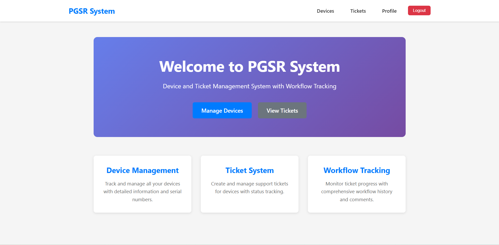
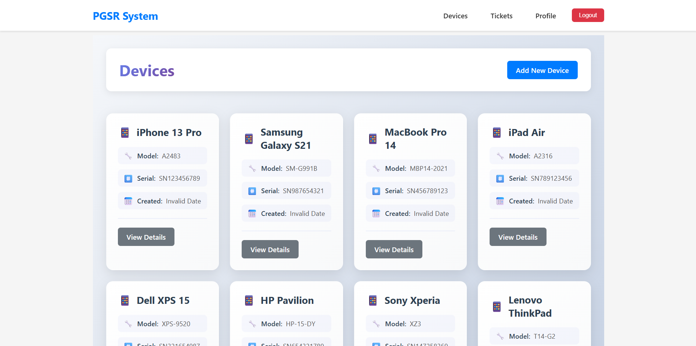
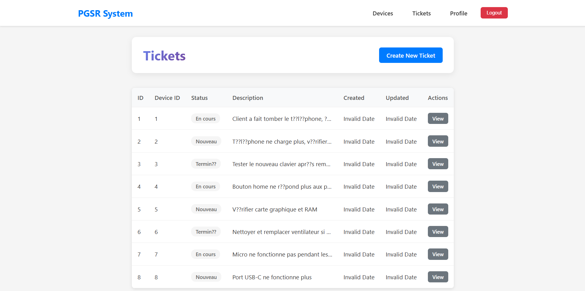
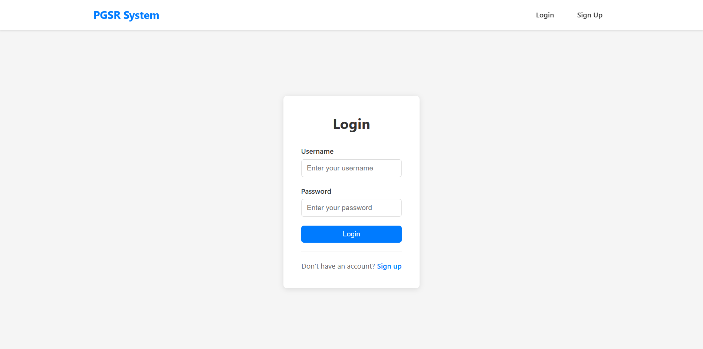

# 🔧 Repair Management Monitoring Platform (PGSR)

A comprehensive web application for managing device repairs, tracking tickets, and monitoring workflow progress. Built with React, Node.js, Express, TypeScript, GraphQL, and MySQL/MariaDB.



## 📋 Table of Contents

- [Features](#features)
- [Technology Stack](#technology-stack)
- [Prerequisites](#prerequisites)
- [Installation](#installation)
- [Running the Application](#running-the-application)
- [Default Credentials](#default-credentials)
- [Application Structure](#application-structure)
- [Screenshots](#screenshots)
- [API Endpoints](#api-endpoints)
- [Database Schema](#database-schema)
- [Contributing](#contributing)
- [License](#license)

## ✨ Features

### 🖥️ Device Management
- **Add, view, edit, and delete devices**
- Track device models and serial numbers
- Beautiful card-based interface with modern design
- Search and filter capabilities



### 🎫 Ticket Management
- **Create and manage repair tickets**
- Link tickets to specific devices and users
- Track ticket status (Nouveau, En cours, Terminé)
- Detailed ticket descriptions and history
- Real-time status updates



### 👥 User Management
- **User authentication and authorization**
- Role-based access control (Admin, Technician)
- Secure password hashing with bcrypt
- JWT token-based authentication
- User profiles



### 🎨 Modern UI/UX
- Responsive design for all devices
- Gradient backgrounds and smooth animations
- Icon-enhanced cards and forms
- Toast notifications for user feedback
- Intuitive navigation

## 🛠️ Technology Stack

### Frontend
- **React 18.2.0** - UI Framework
- **React Router DOM 7.9.6** - Navigation
- **Apollo Client 3.14.0** - GraphQL Client
- **Axios 1.13.2** - HTTP Client
- **React Toastify 11.0.5** - Notifications
- **CSS3** - Styling with gradients and animations

### Backend
- **Node.js** - Runtime Environment
- **Express 4.21.2** - Web Framework
- **TypeScript 5.9.3** - Type Safety
- **Apollo Server 3.13.0** - GraphQL Server
- **TypeORM 0.3.27** - ORM
- **MySQL2 3.15.3** - Database Driver

### Database
- **MariaDB** (or MySQL 8.0)
- Running in Podman container

### Authentication
- **JWT (jsonwebtoken 9.0.2)** - Token-based auth
- **bcryptjs 3.0.3** - Password hashing

## 📦 Prerequisites

Before running the application, ensure you have:

- **Node.js** (v16 or higher)
- **npm** (v7 or higher)
- **Podman** or **Docker**
- **Git**

## 🚀 Installation

### 1. Clone the Repository

```bash
git clone https://github.com/sarahlouazzani/RepairManagmentMonitoringPlatform.git
cd RepairManagmentMonitoringPlatform
```

### 2. Install Dependencies

**Backend dependencies:**
```bash
npm install
```

**Frontend dependencies:**
```bash
cd frontend
npm install
cd ..
```

### 3. Setup Database

**Start MariaDB container with Podman:**
```bash
podman run -d --name repair-mysql --tls-verify=false \
  -e MYSQL_ROOT_PASSWORD=yourpassword \
  -e MYSQL_DATABASE=repair_management \
  -p 3306:3306 \
  docker.io/library/mariadb:latest
```

**Wait for database to initialize (10 seconds), then load test data:**
```powershell
# PowerShell
Get-Content "test-data.sql" | podman exec -i repair-mysql mariadb -uroot -pyourpassword repair_management
```

### 4. Build TypeScript Code

```bash
npm run build
```

## 🎯 Running the Application

### Start Backend Server

```bash
npm start
```

The backend will be available at:
- **REST API**: http://localhost:5000
- **GraphQL**: http://localhost:5000/graphql

### Start Frontend Application

Open a new terminal:

```bash
cd frontend
npm start
```

The frontend will be available at:
- **Frontend**: http://localhost:3001

## 🔐 Default Credentials

The application comes with pre-loaded test users:

| Role | Username | Email | Password |
|------|----------|-------|----------|
| Admin | `admin` | admin@pgsr.com | `testpass123` |
| Technician | `tech1` | tech1@pgsr.com | `testpass123` |
| Technician | `tech2` | tech2@pgsr.com | `testpass123` |

**Login at**: http://localhost:3001

## 📁 Application Structure

```
RepairManagmentMonitoringPlatform/
├── backend/
│   └── src/
│       ├── apolloServer.ts         # GraphQL server setup
│       ├── index.ts                # Main entry point
│       ├── auth/                   # Authentication logic
│       │   ├── authController.ts
│       │   └── authMiddleware.ts
│       ├── config/                 # Database configuration
│       │   └── database.ts
│       ├── controllers/            # REST controllers
│       │   ├── deviceController.ts
│       │   ├── ticketController.ts
│       │   └── workflowController.ts
│       ├── graphql/                # GraphQL schema & resolvers
│       │   ├── resolvers.ts
│       │   └── schema.ts
│       ├── models/                 # TypeORM entities
│       │   ├── Device.ts
│       │   ├── Ticket.ts
│       │   ├── User.ts
│       │   └── Workflow.ts
│       └── routes/                 # API routes
│           ├── authRoutes.ts
│           ├── deviceRoutes.ts
│           ├── ticketRoutes.ts
│           └── workflowRoutes.ts
├── frontend/
│   ├── public/                     # Static files
│   └── src/
│       ├── components/             # React components
│       │   ├── Auth/
│       │   ├── Device/
│       │   ├── Layout/
│       │   ├── Ticket/
│       │   └── Workflow/
│       ├── context/                # React Context
│       │   └── AuthContext.js
│       ├── pages/                  # Page components
│       │   ├── Home.js
│       │   ├── Login.js
│       │   ├── Signup.js
│       │   └── Profile.js
│       └── utils/                  # Utilities
│           ├── api.js
│           ├── apolloClient.js
│           └── graphqlQueries.js
├── img/                            # Screenshots
├── test-data.sql                   # Sample data
├── package.json
├── tsconfig.json
└── README.md
```

## 📸 Screenshots

### Dashboard / Home Page


### Device Management


### Ticket Management


### Workflow Management


### Authentication


## 🔌 API Endpoints

### Authentication
```
POST   /auth/signup      - Register new user
POST   /auth/login       - Login user
GET    /auth/profile     - Get user profile (protected)
```

### Devices
```
GET    /devices          - Get all devices
GET    /devices/:id      - Get device by ID
POST   /devices          - Create new device (protected)
PUT    /devices/:id      - Update device (protected)
DELETE /devices/:id      - Delete device (protected)
```

### Tickets
```
GET    /tickets          - Get all tickets
GET    /tickets/:id      - Get ticket by ID
POST   /tickets          - Create new ticket (protected)
PUT    /tickets/:id      - Update ticket (protected)
DELETE /tickets/:id      - Delete ticket (protected)
```

### Workflows
```
GET    /workflows/ticket/:ticketId  - Get workflows by ticket
POST   /workflows                   - Create new workflow (protected)
```

### GraphQL Endpoint
```
POST   /graphql          - GraphQL queries and mutations
```

## 🗄️ Database Schema

### Users Table
```sql
- id (INT, PRIMARY KEY, AUTO_INCREMENT)
- username (VARCHAR, NOT NULL)
- email (VARCHAR, NOT NULL)
- password (VARCHAR, NOT NULL, HASHED)
- role (VARCHAR, NOT NULL)
- created_at (DATETIME, DEFAULT NOW)
```

### Devices Table
```sql
- id (INT, PRIMARY KEY, AUTO_INCREMENT)
- name (VARCHAR, NOT NULL)
- model (VARCHAR, NOT NULL)
- serial_number (VARCHAR, UNIQUE, NOT NULL)
- created_at (DATETIME, DEFAULT NOW)
```

### Tickets Table
```sql
- id (INT, PRIMARY KEY, AUTO_INCREMENT)
- status (VARCHAR, NOT NULL)
- description (TEXT, NOT NULL)
- device_id (INT, FOREIGN KEY)
- user_id (INT, FOREIGN KEY)
- created_at (DATETIME, DEFAULT NOW)
- updated_at (DATETIME, DEFAULT NOW ON UPDATE)
```

### Workflows Table
```sql
- id (INT, PRIMARY KEY, AUTO_INCREMENT)
- status (VARCHAR, NOT NULL)
- timestamp (DATETIME, DEFAULT NOW)
- comments (VARCHAR)
- ticketId (INT, FOREIGN KEY)
```

## 🔧 Configuration

### Environment Variables

Create a `.env` file in the root directory (optional):

```env
# Database Configuration
DB_HOST=localhost
DB_PORT=3306
DB_USERNAME=root
DB_PASSWORD=yourpassword
DB_NAME=repair_management

# Server Configuration
PORT=5000

# JWT Secret
JWT_SECRET=your_secret_key_here
```

## 🛡️ Security Features

- **Password Hashing**: Passwords are hashed using bcrypt with salt rounds
- **JWT Authentication**: Secure token-based authentication
- **Protected Routes**: Middleware to protect sensitive endpoints
- **CORS Configuration**: Controlled cross-origin resource sharing
- **SQL Injection Prevention**: TypeORM parameterized queries

## 🚦 Testing

The application includes sample test data with:
- 3 test users (admin, tech1, tech2)
- 8 sample devices
- 8 repair tickets
- 9 workflow entries

## 🐛 Troubleshooting

### Database Connection Issues
```bash
# Check if MariaDB container is running
podman ps

# Restart the container
podman restart repair-mysql

# Check container logs
podman logs repair-mysql
```

### Frontend Not Loading
```bash
# Clear npm cache and reinstall
cd frontend
rm -rf node_modules package-lock.json
npm install
npm start
```

### Port Already in Use
```bash
# Find process using port 5000 or 3001
netstat -ano | findstr :5000
netstat -ano | findstr :3001

# Kill the process (replace PID with actual process ID)
taskkill /PID <PID> /F
```

## 📝 Future Enhancements

- [ ] Email notifications for ticket updates
- [ ] File upload for device images
- [ ] Advanced search and filtering
- [ ] Export reports to PDF
- [ ] Dashboard analytics and charts
- [ ] Mobile application
- [ ] Multi-language support
- [ ] Integration with inventory management

## 🤝 Contributing

1. Fork the repository
2. Create your feature branch (`git checkout -b feature/AmazingFeature`)
3. Commit your changes (`git commit -m 'Add some AmazingFeature'`)
4. Push to the branch (`git push origin feature/AmazingFeature`)
5. Open a Pull Request

## 📄 License

This project is licensed under the ISC License.

## 👥 Authors

- **Sarah Louazzani** - Initial work - [sarahlouazzani](https://github.com/sarahlouazzani)

## 🙏 Acknowledgments

- React community for excellent documentation
- TypeORM for simplified database management
- Apollo for GraphQL implementation
- All contributors and testers

---

**Built with ❤️ by Sarah Louazzani**

For questions or support, please open an issue on GitHub.
